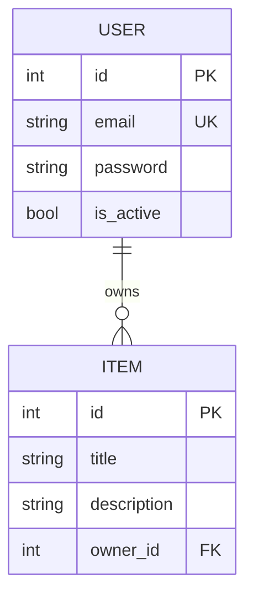

# I1 — Entity-Relationship Diagram

**Target:** `ptrstn/fastapi-sqlalchemy-pytest-example` @ `19047d7`  
**Source:** `src/mypackage/models.py`

## Entities

### User (`user` table)

| Column | Type | Constraints |
|--------|------|-------------|
| `id` | int | PK, indexed |
| `email` | str | unique, indexed |
| `password` | str | stored plain (demo only) |
| `is_active` | bool | default `True` |

### Item (`item` table)

| Column | Type | Constraints |
|--------|------|-------------|
| `id` | int | PK, indexed |
| `title` | str | indexed |
| `description` | str | nullable, indexed |
| `owner_id` | int | FK → `user.id`, nullable |

## Relationship

- **User 1 — N Item** via `User.items` ↔ `Item.owner`
- SQLModel `Relationship(back_populates=...)` on both sides

## Mermaid ER diagram

## Schema ↔ ORM mapping

Response schemas (`schemas.py`) expose subset of columns — e.g. `User` response omits `password`.

## Uncertainties

- `owner_id` nullable on `Item` — items created via POST `/api/items/` may have null owner until associated
- No explicit ON DELETE cascade in model; behavior depends on SQLite defaults
