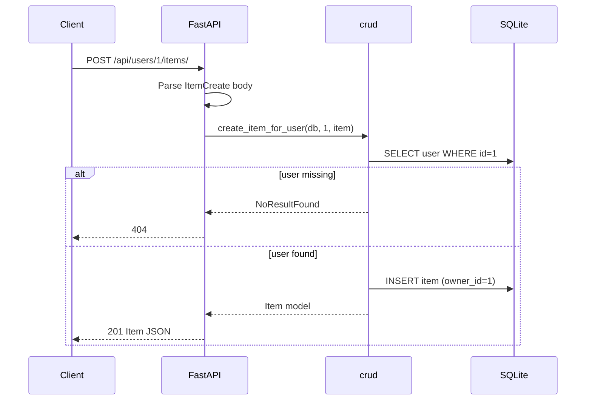

# I2 — End-to-End Flow Trace

**Endpoint traced:** `POST /api/users/{user_id}/items/`  
**Target:** `ptrstn/fastapi-sqlalchemy-pytest-example` @ `19047d7`

## Request

```http
POST /api/users/1/items/ HTTP/1.1
Content-Type: application/json

{"title": "Widget", "description": "demo"}
```

## Step-by-step path

| Step | Layer | File / symbol | Action |
|------|-------|---------------|--------|
| 1 | Routing | `main.py` → `api_router` | Request enters FastAPI app |
| 2 | Router | `api/v1/router.py` | Prefix `/api`, delegates to items router |
| 3 | Endpoint | `endpoints/items.py` → `create_item_for_user` | Validates path `user_id`, body `ItemCreate` |
| 4 | DI | `database.get_session` | Opens SQLModel session |
| 5 | CRUD | `crud.create_item_for_user` | `db.get(User, user_id)` — raises `NoResultFound` if missing |
| 6 | ORM | `models.Item` | New row with `owner` relationship set |
| 7 | DB | SQLite via SQLAlchemy engine | INSERT into `item` |
| 8 | Response | `schemas.Item` | 201 with `id`, `title`, `description`, `owner_id` |

## Sequence diagram



## Side effects

- One row inserted into `item` table
- `owner_id` set to path parameter
- Transaction committed in `crud.create_item_for_user`

## External dependencies

- SQLite database file or in-memory DB (from settings)
- No external HTTP calls

## Known uncertainties

- Integrity errors on duplicate titles not explicitly handled
- Password never involved in this flow
